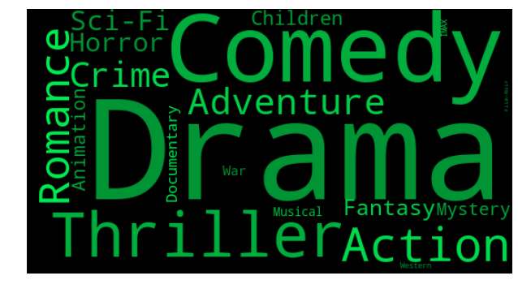

# Movie-recommender
---
[](https://travis-ci.com/vbelz/Movie-recommender)
>
>
## Introduction


This project aims at building a movie recommender with a Flask web interface.
You can visit the website at this [link](http://vincentbelz.pythonanywhere.com).Please note that it might
take up to 1 min to display the result page (i have limited resources in the free plan).

The dataset of movies and ratings I will be using is the movielens dataset available at:

[https://grouplens.org/datasets/movielens/](https://grouplens.org/datasets/movielens/)

## Prepare the database

I provide a sqlite database at `data/movielens.db` in order to run the program (this section can be skipped to test the recommender).

To update it regularly including new movies (or create your own database), download `movies.csv` and `ratings.csv` from [https://grouplens.org/datasets/movielens/](https://grouplens.org/datasets/movielens/) and place them in the folder `data`.

Then run `python prepare_database.py` (make sure you delete the old database before).

It will extract the years from movies title, clean the title with regex and merge them into a database containing
`['userId','movieId','rating','title','genres','year','timestamp']`. Then it will be saved as a sqlite database
in the folder `data`.

In the code there is the option to save it as a postgres database  as well (turn `Save_to_postgres` to True).
By default it will only be saved as a sqlite database (because it is the option i used to deploy on the web at pythonanywhere with the free plan).

Below, a word cloud created based on the appearance of movies genres in the database:



## Flask web server

The python file that will house the instructions for launching a web server is
available at `application.py`

It consists in three functions `index`, `recommender` and `results` related to the templates
`index.html`, `recommender.html` and `results.html` provided in `templates` folder.

The index page will welcome the user and invite him to access the recommender page. In the recommender page,
the user will be asked to fill a form and rate 5 movies of his choice. These movies and ratings will be passed
to the results function via `request.args`. Then, the Recommender class (see next section for more details)
will be instantiate with these values and will predict the 5 movies to recommend. These movies will then be
printed in the `results.html` page.

To visit your website locally, run `bash ./run_server.sh` and then open `http://127.0.0.1:5000/` in your
browser. It should take some seconds to return the recommended movies.


## Movie recommendation

The *Recommender* class available at `recommender_tools.py` can predict movies recommendations
based on Non-negative matrix factorization (NMF) or cosine similarity.

The Recommender class is instantiated with the values provided by the user.
It then reads the local sqlite database and search the correspondence between the title provided
by the user and the titles in the database (with the help of fuzzywuzzy package  that uses Levenshtein
distance to calculate the differences between sequences). It creates a new vector of movies ratings for
the user (a vector containing all the movies Ids of the database and ratings for the movies the user chose).

It then calls the prediction function to return the recommended movies.

There is two prediction functions `prediction_nmf` and `prediction_cosim`.
`prediction_nmf` will predict the movies based on  Non-negative matrix factorization of the Matrix
(user_id, movie_id, ratings). A saved model is provided at `data/nmf_model_rating.bin` , but if
not present in the folder, the class will train a model from scratch using the database (it might be useful to update the model regularly when updating the database) and save it to disk.

`prediction_cosim` will predict the movies based on cosine similarity between the new vector of movies ratings
by the user and the movies ratings of all users of the database.

It will select the three closest users from the database and pick up 5 of the best rated movies by these users(excluding the movies already rated by the new user).

By default, the `Recommender` class will predict with the cosine similarity method (it was performing better
than NMF on tests for new user). But you can easily called the NMF prediction instead by calling the
`prediction_nmf` method of the `Recommender` class.


## How to use?

```
Clone this repository
pip install -r requirements.txt
bash ./run_server.sh
Visit at http://127.0.0.1:5000/
```

## License

[](http://badges.mit-license.org)

- **[MIT license](http://opensource.org/licenses/mit-license.php)**
